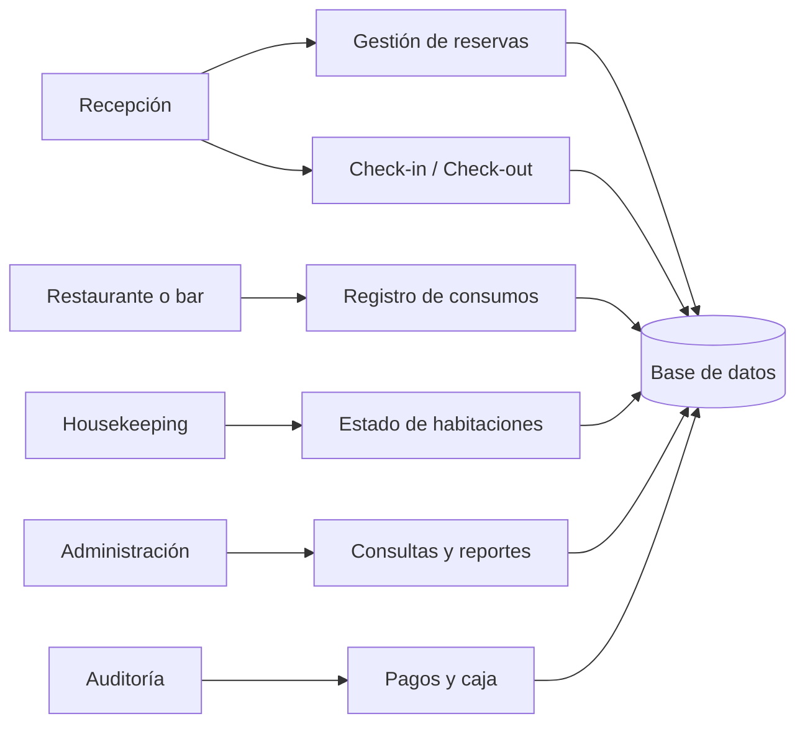
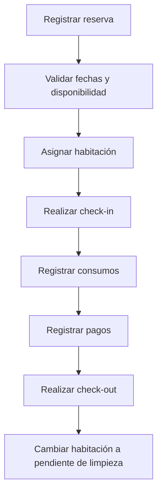
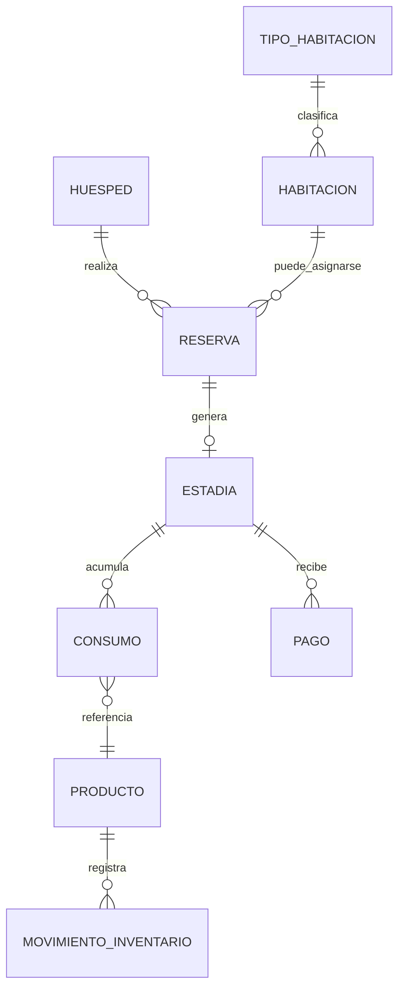

# Diagramas Iniciales — Sistema Hotelero

Estos diagramas son puntos de partida para interpretar el dominio. No representan el modelo final obligatorio.

## 1. Diagrama de contexto

## 2. Flujo inicial de estadía

## 3. Modelo conceptual inicial

## 4. Relaciones que el estudiante debe analizar

- Una reserva puede o no convertirse en estadía.
- Una habitación puede tener muchos estados a lo largo del tiempo.
- Un consumo puede estar asociado a una estadía o ser venta directa.
- Un pago puede cubrir una o varias obligaciones del dominio.
- Un producto puede afectar inventario, pero el equipo debe decidir cómo registrar esos movimientos.

## 5. Posible consulta compleja

Pregunta orientadora:

> Qué huéspedes tuvieron estadías finalizadas en un periodo, con habitación asignada, consumos registrados, productos consumidos y pagos asociados?

Esta pregunta puede requerir un JOIN de más de 5 tablas, pero el diseño exacto depende del modelo construido por el equipo.
