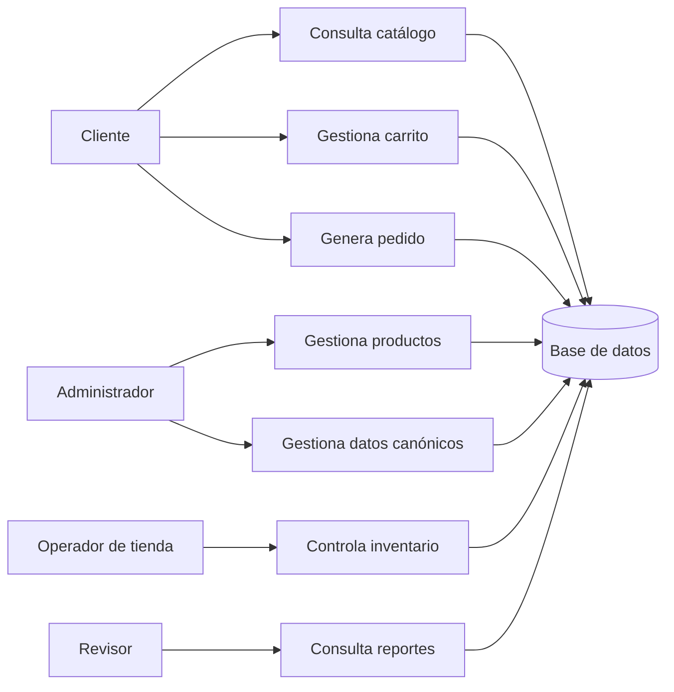
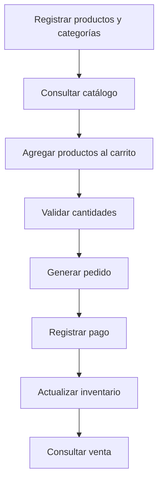
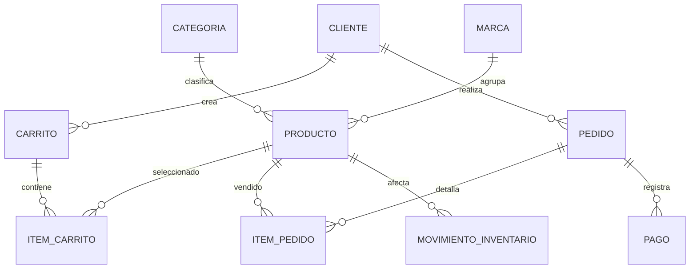

# Diagramas Iniciales — Skin Care Store

Estos diagramas son puntos de partida para interpretar el dominio. No representan el modelo final obligatorio.

## 1. Diagrama de contexto

## 2. Flujo inicial de compra

## 3. Modelo conceptual inicial

## 4. Relaciones que el estudiante debe analizar

- Un carrito puede o no convertirse en pedido.
- Un pedido debe conservar detalle de productos, cantidades y valores.
- Un producto puede tener categoría, marca o clasificación equivalente.
- Un movimiento de inventario debe explicar el cambio de existencia.
- Un pago debe estar relacionado con una operación válida.
- Una reseña puede relacionarse con cliente y producto, pero el equipo debe definir sus condiciones.

## 5. Posible consulta compleja

Pregunta orientadora:

> Qué clientes realizaron pedidos pagados en un periodo, con detalle de productos, categoría, marca y movimiento de inventario asociado?

Esta pregunta puede requerir un JOIN de más de 5 tablas, pero el diseño exacto depende del modelo construido por el equipo.
